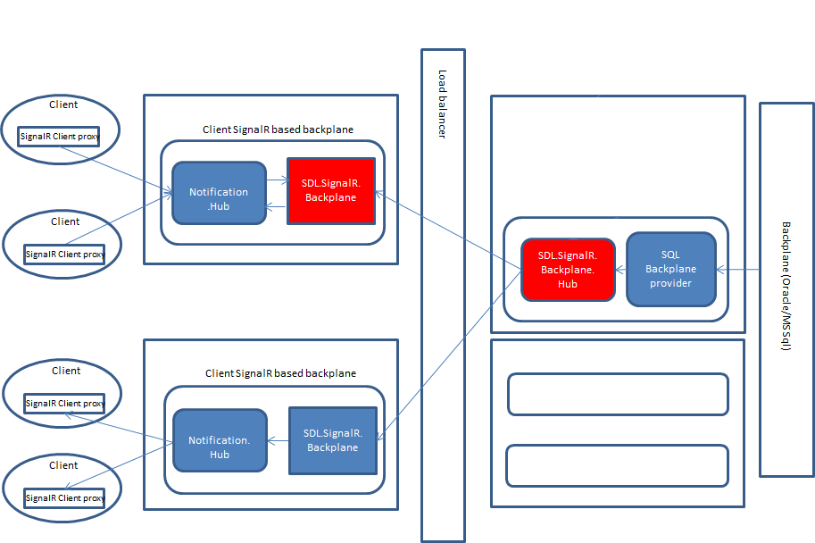

SignalR based backplane provider
=====================

SignalR scalability using SignalR as backplane.

----------

About
-------------

SignalR is being used in more and more projects. But, scaling SignalR application has an inherent limitation, where the web application needs to be able to talk to a backplane directly. In some cases this kind of deployment maybe unacceptable. When we were trying to leverage SignalR for realtime notifications, we encountered this exact limitation, where we did not want our web application to directly talk to a datastore, be it SQL Server or REDIS. Also having this knowledge in the web application means that the deployment of the web application would be different based on the backplane. This also means, that if our backend services needed to use that backplane it would also need to know the kind of backplane and how to deploy.

Hence, we decided to abstract the specific backplane information from the web application and any other components who would need to access the backplane. We ended up creating a backplane provider which is based on SignalR.

Branches and Contributions
-------------
* master - Represents the latest stable version. This may be a pre-release version
* dev - Represents the current development branch.

License
-------------

Copyright (c) 2017 SDL Group.

Licensed under the Apache License, Version 2.0 (the "License"); you may not use this file except in compliance with the License. You may obtain a copy of the License at

http://www.apache.org/licenses/LICENSE-2.0
Unless required by applicable law or agreed to in writing, software distributed under the License is distributed on an "AS IS" BASIS, WITHOUT WARRANTIES OR CONDITIONS OF ANY KIND, either express or implied. See the License for the specific language governing permissions and limitations under the License.